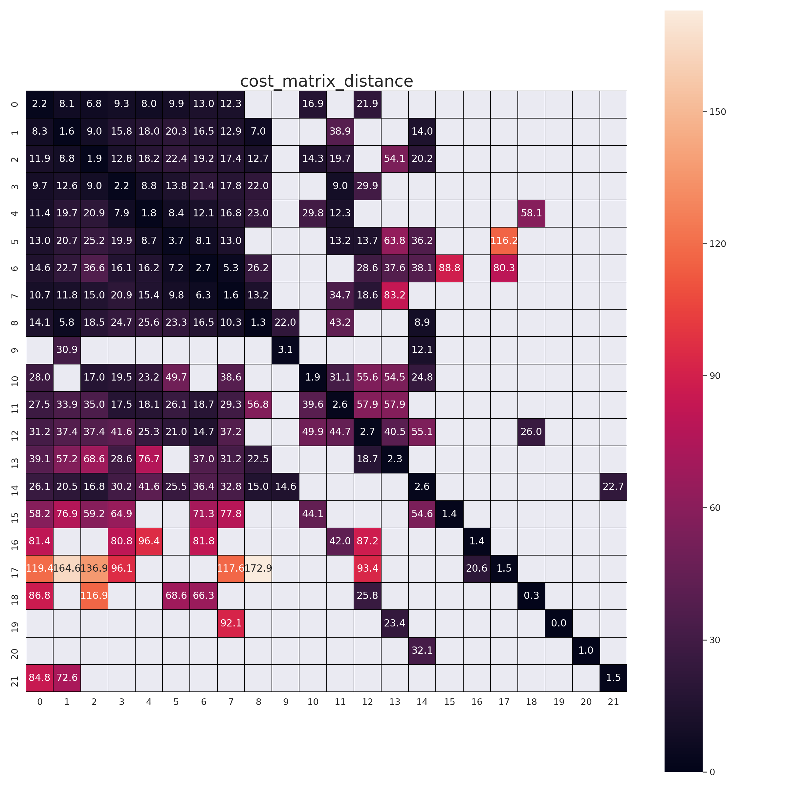
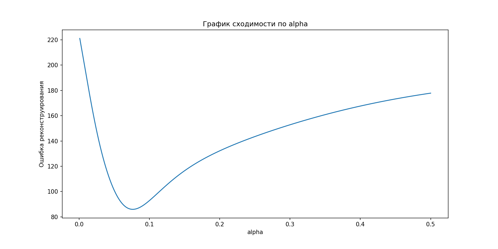

# Подготовка и загрузка данных

Итак, истинная матрица корреспонденций выглядит следующим образом:

Матрицы времён и расстояний соответственно:

# Восстановление матрицы корреспонденций

Сначала определим функцию затрат как f = exp(alpha * time), где alpha -- настраиваемый параметр. Задача заключается в том, чтобы подобрать такое значение alpha, при котором матрица корреспонденций восстанавливается наилучшим образом (в качестве невязки будем использовать норму Фробениуса матрицы ошибок). В этом случае график сходимости выглядит следующим образом:

Наилучшее значение alpha = 0.076.

Восстановленная матрица корреспонденций:

Теперь расширим класс функций затрат посредством введения ещё одного параметра -- beta. Наша функция затрат будет выглядеть как f = exp(alpha * (time^beta)). В этом случае уже не удаётся нарисовать двумерный график на плоскости, поэтому нарисуем матрицу ошибок, где значение ошибки изобразим в виде цвета:

Наилучшие значения параметров: alpha = 1.198, beta = 0.472.

